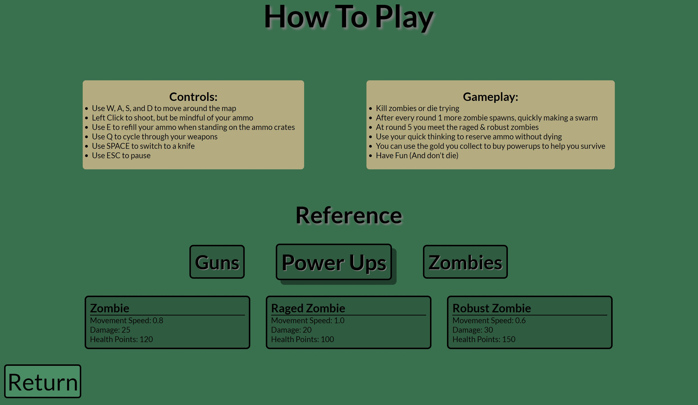

# ZombieHunters2D
- I started making ZH2D in quarantine when I first started coding. I decided to make a zombie game for many differnt reasons. Firstly, I wanted to make an endless game so that it could be played continuously, rather than being thrown to the side after all of the levels were beat. Secondly, since zombies are mindless, there simple AI would not be too hard on a novice programmer. Lastly, who doesn't love a fun zombie game!

You can play [here](https://zombiehunters2d.netlify.app/).

## How to play
 - Every round, you have to defeat that many zombies to advance to the next round.
 - The zombie quickly become too much to handle once you reach level 5 to unlock the raged (red) and robust (purple) zombies.
 - Killing zombies gives you gold, which you can use to buy powerups.

## Development
 - ZH2D was made using a JavaScript framework called [p5.js](https://p5js.org/).
 - All graphics that were not made using that library were drawn by @leolanni03 on Instagram.
 - HTML and CSS were used to make the ZH2D Hub (to access: click the gear on the title screen). In the ZH2D Hub, you can rebind your keys, or check out some simple documentation for the game. Part of it is shown below:
   
